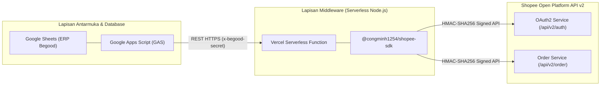
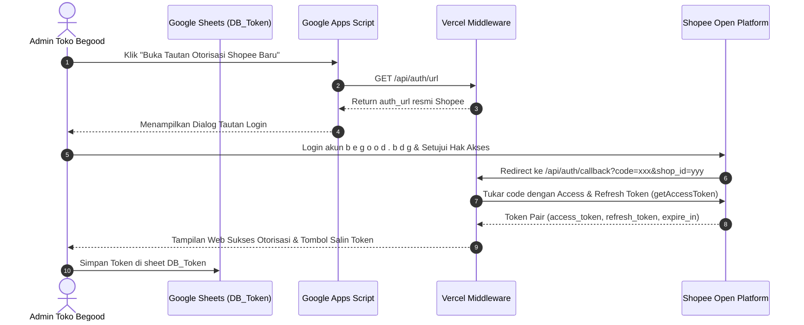
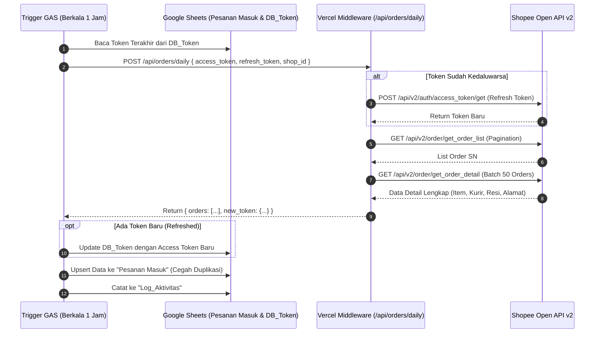

# Arsitektur Sistem ERP Mandiri Begood

Dokumen ini menjelaskan rancangan arsitektur teknis sistem ERP mandiri untuk toko online **b e g o o d . b d g** di Shopee, yang mengintegrasikan Google Sheets sebagai antarmuka/database dan Vercel sebagai serverless middleware.

---

## 🏛️ Gambaran Umum Arsitektur

Integrasi langsung antara Google Apps Script (GAS) dan Shopee Open API v2 memiliki sejumlah tantangan teknis:
1. **Penandatanganan Kriptografi (HMAC-SHA256)**: Shopee Open API v2 mewajibkan setiap permintaan HTTP ditandatangani menggunakan HMAC-SHA256 dengan kombinasi `partner_id`, `path`, `timestamp`, `access_token`, dan `shop_id`. Menjalankan penandatanganan ini secara stabil di runtime GAS V8 rentan terhadap latensi dan kesalahan urutan payload.
2. **Keterbatasan Eksekusi GAS**: Runtime GAS memiliki batas waktu eksekusi maksimal 6 menit per trigger, serta kuota `UrlFetchApp` yang ketat.
3. **Pustaka Resmi / Komunitas Modern**: Pustaka `@congminh1254/shopee-sdk` berbasis TypeScript/ES Module modern (`"type": "module"`), yang dirancang untuk dieksekusi di lingkungan Node.js >= 20.

Oleh karena itu, arsitektur ERP Begood membagi sistem menjadi dua lapisan utama:

---

## 🔄 Alur Otorisasi OAuth2 Shopee

Shopee menerapkan protokol OAuth 2.0 untuk memberikan akses aman bagi aplikasi penjual:
- **Access Token**: Masa aktif **4 jam** (digunakan untuk memanggil endpoint pesanan dan produk).
- **Refresh Token**: Masa aktif **30 hari** (digunakan untuk memperbarui access token tanpa login ulang).

---

## ⚡ Alur Penarikan Pesanan & Auto-Healing Token

Sistem ERP Begood dirancang dengan fitur **Self-Healing Token**:
Jika token yang tersimpan di spreadsheet telah kedaluwarsa atau mendekati waktu kedaluwarsa (< 10 menit), middleware secara otomatis meminta token baru ke Shopee API menggunakan `refresh_token`, menyelesaikan penarikan pesanan, lalu mengembalikan pesanan sekaligus token baru untuk diperbarui di `DB_Token`.

---

## 🛡️ Standar Keamanan & Proteksi Data

1. **Header Secret Guard (`BEGOOD_API_SECRET`)**:
   Setiap permintaan dari Google Apps Script ke middleware Vercel diverifikasi menggunakan header `x-begood-secret`. Permintaan tanpa secret yang cocok akan langsung ditolak dengan kode `401 Unauthorized`.
2. **Kredensial Serverless Terisolasi**:
   `SHOPEE_PARTNER_KEY` tidak pernah disimpan di Google Spreadsheet maupun terekspos ke klien; kunci utama disimpan aman di Environment Variables Vercel.
3. **Penyimpanan Plain Text Nomor Penting**:
   Kolom Nomor Pesanan dan Nomor Resi diatur berformat teks (`@`) pada spreadsheet untuk mencegah konversi angka besar menjadi notasi ilmiah (misal: `2.60925E+13`).
4. **Proteksi Perubahan Manual**:
   Fungsi upsert pesanan memeriksa apakah nomor pesanan sudah ada. Jika sudah ada, sistem hanya memperbarui status Shopee, ongkir, dan resi tanpa menimpa status internal atau catatan yang telah diedit oleh tim operasional gudang.
