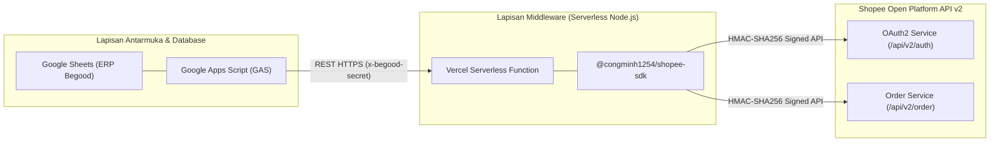
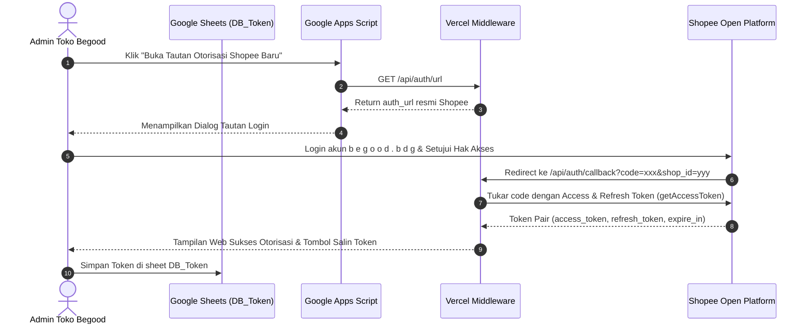
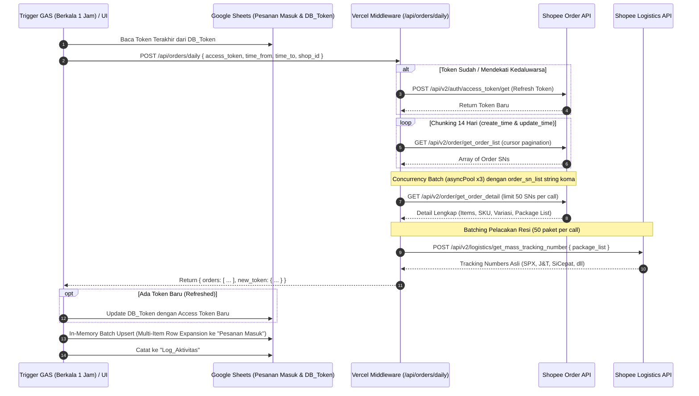

# Arsitektur Sistem ERP Mandiri Begood

Dokumen ini menjelaskan rancangan arsitektur teknis sistem ERP mandiri untuk toko online **b e g o o d . b d g** di Shopee, yang mengintegrasikan Google Sheets sebagai antarmuka/database dan Vercel sebagai serverless middleware.

---

## 🏛️ Gambaran Umum Arsitektur

Integrasi langsung antara Google Apps Script (GAS) dan Shopee Open API v2 memiliki sejumlah tantangan teknis:
1. **Penandatanganan Kriptografi (HMAC-SHA256)**: Shopee Open API v2 mewajibkan setiap permintaan HTTP ditandatangani menggunakan HMAC-SHA256 dengan kombinasi `partner_id`, `path`, `timestamp`, `access_token`, dan `shop_id`. Menjalankan penandatanganan ini secara stabil di runtime GAS V8 rentan terhadap latensi dan kesalahan urutan payload.
2. **Keterbatasan Eksekusi GAS**: Runtime GAS memiliki batas waktu eksekusi maksimal 6 menit per trigger, serta kuota `UrlFetchApp` yang ketat.
3. **Pustaka Resmi / Komunitas Modern**: Pustaka `@congminh1254/shopee-sdk` berbasis TypeScript/ES Module modern (`"type": "module"`), yang dirancang untuk dieksekusi di lingkungan Node.js >= 20.

Oleh karena itu, arsitektur ERP Begood membagi sistem menjadi dua lapisan utama:

```mermaid
flowchart LR
    subgraph Klien["Lapisan Antarmuka & Database"]
        GS["Google Sheets (ERP Begood)"]
        GAS["Google Apps Script (GAS)"]
        GS --- GAS
    end

    subgraph Middleware["Lapisan Middleware (Serverless Node.js)"]
        Vercel["Vercel Serverless Function"]
        SDK["@congminh1254/shopee-sdk"]
        Vercel --- SDK
    end

    subgraph Shopee["Shopee Open Platform API v2"]
        ShopeeAuth["OAuth2 Service (/api/v2/auth)"]
        ShopeeOrder["Order Service (/api/v2/order)"]
    end

    GAS -- "REST HTTPS (x-begood-secret)" --> Vercel
    SDK -- "HMAC-SHA256 Signed API" --> ShopeeAuth
    SDK -- "HMAC-SHA256 Signed API" --> ShopeeOrder
```

---

## 🔄 Alur Otorisasi OAuth2 Shopee

Shopee menerapkan protokol OAuth 2.0 untuk memberikan akses aman bagi aplikasi penjual:
- **Access Token**: Masa aktif **4 jam** (digunakan untuk memanggil endpoint pesanan dan produk).
- **Refresh Token**: Masa aktif **30 hari** (digunakan untuk memperbarui access token tanpa login ulang).

```mermaid
sequenceDiagram
    autonumber
    actor Admin as Admin Toko Begood
    participant Sheet as Google Sheets (DB_Token)
    participant GAS as Google Apps Script
    participant Vercel as Vercel Middleware
    participant Shopee as Shopee Open Platform

    Admin->>GAS: Klik "Buka Tautan Otorisasi Shopee Baru"
    GAS->>Vercel: GET /api/auth/url
    Vercel-->>GAS: Return auth_url resmi Shopee
    GAS-->>Admin: Menampilkan Dialog Tautan Login
    Admin->>Shopee: Login akun b e g o o d . b d g & Setujui Hak Akses
    Shopee->>Vercel: Redirect ke /api/auth/callback?code=xxx&shop_id=yyy
    Vercel->>Shopee: Tukar code dengan Access & Refresh Token (getAccessToken)
    Shopee-->>Vercel: Token Pair (access_token, refresh_token, expire_in)
    Vercel-->>Admin: Tampilan Web Sukses Otorisasi & Tombol Salin Token
    Admin->>Sheet: Simpan Token di sheet DB_Token
```

---

## ⚡ Alur Penarikan Pesanan & Auto-Healing Token

Sistem ERP Begood dirancang dengan fitur **Self-Healing Token**:
Jika token yang tersimpan di spreadsheet telah kedaluwarsa atau mendekati waktu kedaluwarsa (< 10 menit), middleware secara otomatis meminta token baru ke Shopee API menggunakan `refresh_token`, menyelesaikan penarikan pesanan, lalu mengembalikan pesanan sekaligus token baru untuk diperbarui di `DB_Token`.

```mermaid
sequenceDiagram
    autonumber
    participant Trigger as Trigger GAS (Berkala 1 Jam) / UI
    participant Sheet as Google Sheets (Pesanan Masuk & DB_Token)
    participant Vercel as Vercel Middleware (/api/orders/daily)
    participant ShopeeOrder as Shopee Order API
    participant ShopeeLogistics as Shopee Logistics API

    Trigger->>Sheet: Baca Token Terakhir dari DB_Token
    Trigger->>Vercel: POST /api/orders/daily { access_token, time_from, time_to, shop_id }
    
    alt Token Sudah / Mendekati Kedaluwarsa
        Vercel->>ShopeeOrder: POST /api/v2/auth/access_token/get (Refresh Token)
        ShopeeOrder-->>Vercel: Return Token Baru
    end

    loop Chunking 14 Hari (create_time & update_time)
        Vercel->>ShopeeOrder: GET /api/v2/order/get_order_list (cursor pagination)
        ShopeeOrder-->>Vercel: Array of Order SNs
    end

    Note over Vercel,ShopeeOrder: Concurrency Batch (asyncPool x3) dengan order_sn_list string koma
    Vercel->>ShopeeOrder: GET /api/v2/order/get_order_detail (limit 50 SNs per call)
    ShopeeOrder-->>Vercel: Detail Lengkap (Items, SKU, Variasi, Package List)

    Note over Vercel,ShopeeLogistics: Batching Pelacakan Resi (50 paket per call)
    Vercel->>ShopeeLogistics: POST /api/v2/logistics/get_mass_tracking_number { package_list }
    ShopeeLogistics-->>Vercel: Tracking Numbers Asli (SPX, J&T, SiCepat, dll)

    Vercel-->>Trigger: Return { orders: [ ... ], new_token: { ... } }

    opt Ada Token Baru (Refreshed)
        Trigger->>Sheet: Update DB_Token dengan Access Token Baru
    end

    Trigger->>Sheet: In-Memory Batch Upsert (Multi-Item Row Expansion ke "Pesanan Masuk")
    Trigger->>Sheet: Catat ke "Log_Aktivitas"
```

---

## 🎨 Tampilan Dashboard dan Arah Desainnya

Halaman dashboard berada di satu berkas, `gas/Index.html`. Di bagian paling atas berkas itu ada blok **DESIGN READ**: arahan tertulis yang diikuti markup di bawahnya. Blok itu memuat tiga dial (ENERGY, RHYTHM, MOTION), bahasa visualnya, dan motif identitasnya. Setiap perubahan tampilan yang besar sebaiknya memperbarui blok itu lebih dulu, karena blok itu yang membuat keputusan desain dapat diperiksa, bukan hanya dirasakan.

| Keputusan | Isinya | Alasan |
|---|---|---|
| Dua bidang | Kerangka gelap untuk navigasi, bidang terang untuk data | Mata tahu ia sedang berada di mana tanpa harus membaca, dan data selalu ada di bidang yang paling terang |
| Kartu di atas abu | Kartu putih di atas `#f3f4f6`, bukan di atas putih | Kartu putih di atas latar putih tidak terbaca sebagai kartu |
| Tiga radius | Kendali 8px, permukaan kartu 12px, lencana bulat penuh | Bentuk yang berbeda memberi tahu benda apa itu. Lencana yang bulat tidak terbaca sebagai tombol |
| Grafik monokrom | Batang hitam pekat, tanpa warna | Warna sudah dipakai untuk menandai keadaan. Grafik yang berwarna-warni membuat keadaan kehilangan tandanya |
| Hijau dan merah terbatas | Hanya pada status dan arah angka | Peringatan yang muncul di mana-mana berhenti menjadi peringatan |
| Satu aksen | Oranye merek, hanya pada tanda merek di sidebar | Warna itu sudah tercetak di setiap label produk toko |
| Bayangan berhemat | Kartu memakai bayangan halus, modal dan bilah atas memakai bayangan angkat | Kalau semuanya mengambang, tidak ada yang benar-benar menonjol |
| Mode gelap tetap ada | Token warna punya pasangan gelapnya | Fitur yang sudah ada tidak dihapus diam-diam saat tampilan diganti. Di mode gelap, grafiknya dibalik menjadi terang, bukan diwarnai |

Dua nilai dari brief digelapkan satu langkah, dan itu disengaja: teks sekunder `#6b7280` menjadi `#5f6672` (pada latar abu nilainya hanya 4.38:1, di bawah ambang 4.5:1), dan hijau status `#10b981` menjadi `#067a4b` (pada ukuran 11px hanya 3.49:1). Rona warnanya tetap sama; yang berubah hanya gelapnya, supaya teks kecil benar-benar terbaca. Angka kontras lengkapnya tertulis di blok DESIGN TOKENS pada berkas yang sama.

#### Arah yang diganti, dan harga yang dibayar

Arahan sebelumnya menolak sidebar, baris kartu KPI, dan urutan grafik-lalu-tabel, dengan alasan yang masih berlaku: yang dibaca petugas gudang adalah tabelnya, bukan grafiknya. Arahan itu diganti atas permintaan pemilik produk, supaya angka ringkas terbaca lebih dulu.

Harga yang dibayar ditulis terbuka, bukan disembunyikan: **tabel pesanan, yang sebenarnya alasan orang membuka layar ini, kini berada di bawah kartu dan grafik.** Karena itu grafik tidak diletakkan di bagian Pesanan masuk. Bagian itu tetap berisi panel antrian, kartu angka, lalu tabel. Grafiknya berada di bagian Analisis, satu klik dari sana.

Berkas `dashboard-preview.html` di akar repositori adalah salinan statis untuk membuka desainnya di peramban tanpa deploy. Salinan itu punya blok harness yang meniru `google.script.run` dengan data contoh. Berkas itu bukan bagian dari yang di-deploy dan tidak dirujuk oleh kode mana pun.

---

## 🛡️ Standar Keamanan & Proteksi Data

1. **Header Secret Guard (`BEGOOD_API_SECRET`)**:
   Setiap permintaan dari Google Apps Script ke middleware Vercel diverifikasi menggunakan header `x-begood-secret`. Permintaan tanpa secret yang cocok akan langsung ditolak dengan kode `401 Unauthorized`.
2. **Kredensial Serverless Terisolasi**:
   `SHOPEE_PARTNER_KEY` tidak pernah disimpan di Google Spreadsheet maupun terekspos ke klien; kunci utama disimpan aman di Environment Variables Vercel.
3. **Penyimpanan Plain Text Nomor Penting**:
   Kolom Nomor Pesanan, Nomor Referensi SKU, dan Nomor Resi diatur berformat teks (`@`) pada spreadsheet untuk mencegah konversi angka besar menjadi notasi ilmiah (misal: `2.60925E+13`).
4. **Proteksi Perubahan Manual (Smart Upsert)**:
   Fungsi upsert pesanan memeriksa apakah nomor pesanan sudah ada. Jika sudah ada, sistem hanya memperbarui status Shopee, ekspedisi, dan resi tanpa menimpa status internal atau catatan yang telah diedit oleh tim operasional gudang.
5. **In-Memory Batch Writing**:
   Seluruh data baris dibaca, dimodifikasi, dan ditulis ke spreadsheet dalam array 2D in-memory (bukan cell-by-cell). Proses ratusan hingga ribuan baris selesai dalam 1 detik tanpa memicu batas waktu eksekusi Google Apps Script (6 menit limit).

---

Catatan: pengelolaan beberapa toko Shopee di bawah satu app sudah dikerjakan sebagian, sampai tahap sinkronisasi. Yang sudah berlaku: `DB_Token` menyimpan satu baris per toko, sheet `Pesanan Masuk` memakai kolom Q `Toko` sebagai penanda, `Log_Aktivitas` mencatat toko pelaksana, dan sinkronisasi menarik seluruh toko aktif secara berurutan dengan isolasi galat per toko. Yang belum dikerjakan: cakupan data per toko di dashboard dan pemecahan trigger per toko. Rinciannya di `docs/arsitektur-multi-toko.md`.

Dua perubahan yang memengaruhi isi dokumen ini: `upsertOrders()` kini membatasi pencocokannya pada baris satu toko, dan `syncOrdersCore()` menerima parameter ketiga berisi kode toko.

